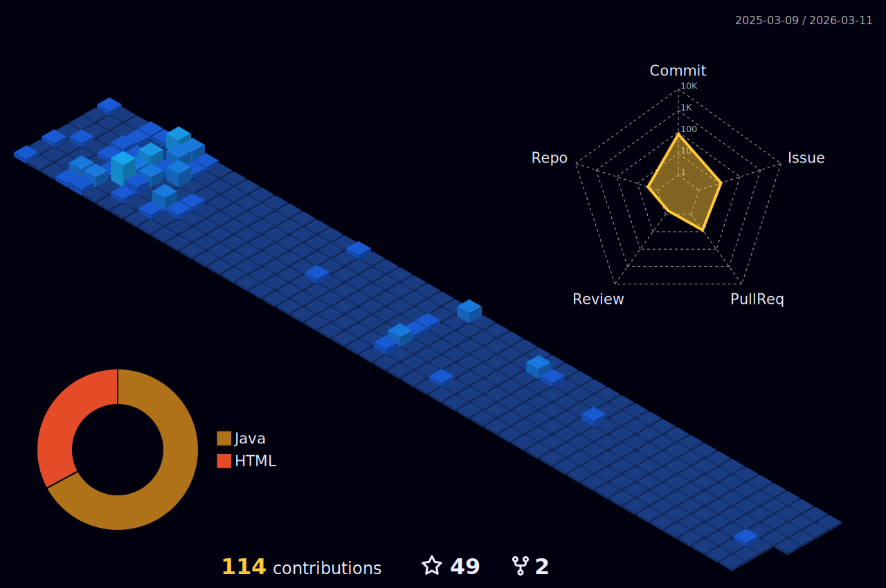

[](https://www.java.com/zh-CN/) [](https://www.python.org/) [](https://www.javascript.com/)


### 👋 Hello, I'm Haotian  Ma


```java
public class Student {

   private String name = "Maotian Ma";

   private String role = "Postgraduate";

   private String[] schools = {"UESTC","HBU"};

   private String[] programmingLanguages = {"Java","Python","C/C++","JavaScript"};
   
}
```


- 🏫 Graduated from [HBU](https://www.hbu.edu.cn/), now pursuing master's degree in [UESTC](https://www.uestc.edu.cn/)
- 👤 I'am a member of [MobiNetS](https://mobinets.cn/site/Main_Page) 
- 📑 Here is My [Blog](https://qylh.xyz/)

<!--
- ⌨ Java | Python | C/C++ | JavaScript
- 💙 Spring | Vue | Linux | OS | Network
-->


  


<!--[](https://github.com/qy-liuhuo#gh-dark-mode-only)
[](https://github.com/qy-liuhuo#gh-light-mode-only)
-->


<div style="display:inline-block">
<h3 align="left">Skills:</h3>
<p align="left"> 
<a href="https://www.java.com" target="_blank" rel="noreferrer">  </a> 
<a href="https://www.python.org" target="_blank" rel="noreferrer">  </a> 
<a href="https://www.cprogramming.com/" target="_blank" rel="noreferrer">  </a>
<a href="https://www.w3schools.com/cpp/" target="_blank" rel="noreferrer">  </a> 
<a href="https://developer.mozilla.org/en-US/docs/Web/JavaScript" target="_blank" rel="noreferrer">  </a> 
<a href="https://www.typescriptlang.org/" target="_blank" rel="noreferrer">  </a>    
<a href="https://golang.org" target="_blank" rel="noreferrer">  </a> 
<a href="https://www.w3.org/html/" target="_blank" rel="noreferrer">  </a> 
<a href="https://www.php.net" target="_blank" rel="noreferrer">  </a> 
</p>
<p align="left"> 
<a href="https://spring.io/" target="_blank" rel="noreferrer">  </a>
<a href="https://flask.palletsprojects.com/" target="_blank"
    rel="noreferrer">  </a> 
<a href="https://getbootstrap.com" target="_blank" rel="noreferrer">  </a>
<a href="https://vuejs.org/" target="_blank" rel="noreferrer">
     </a>
<a href="https://www.electronjs.org" target="_blank" rel="noreferrer">  </a> 
<a href="hexo.io/" target="_blank" rel="noreferrer">  </a> 
<a href="https://www.arduino.cc/" target="_blank" rel="noreferrer">  </a>
</p>

<p align="left"> 
<a href="https://www.mysql.com/" target="_blank" rel="noreferrer">
     </a> 
<a href="https://redis.io" target="_blank" rel="noreferrer">  </a> 
<a href="https://www.mongodb.com/" target="_blank" rel="noreferrer">  </a>
<a href="https://www.elastic.co" target="_blank" rel="noreferrer"></a> 

</p>

<p align="left"> 
<a href="https://www.linux.org/" target="_blank" rel="noreferrer">  </a>
<a href="https://git-scm.com/" target="_blank" rel="noreferrer">  </a> 
<a href="https://www.jenkins.io" target="_blank"
    rel="noreferrer">  </a> 
<a href="https://www.docker.com/" target="_blank" rel="noreferrer">  </a> 
<a href="https://www.nginx.com" target="_blank" rel="noreferrer">
     </a> 
</p></div>
<!-- 
 -->



<!--
<table>
   <td  style="border:0">
      

   </td>
   <td  style="border:0">
      
   [](https://github.com/qy-liuhuo#gh-dark-mode-only)
   [](https://github.com/qy-liuhuo#gh-light-mode-only)

   </td>
</table>
-->


